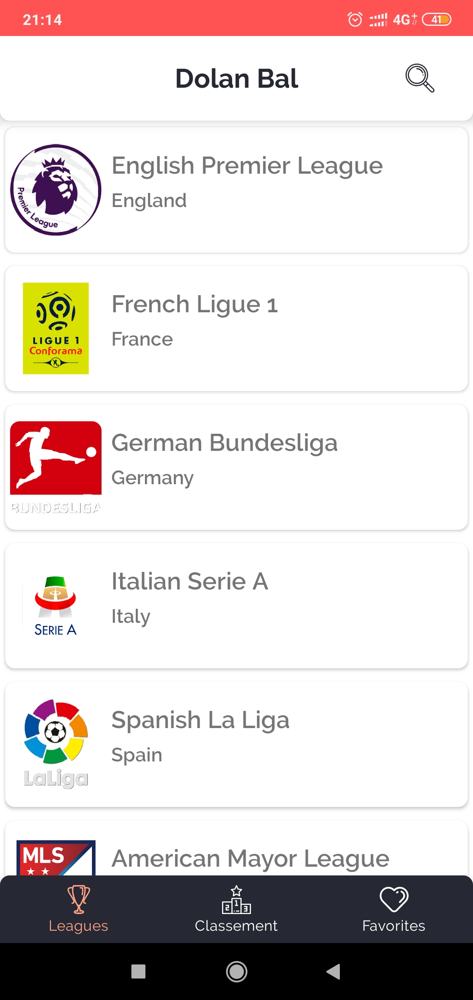
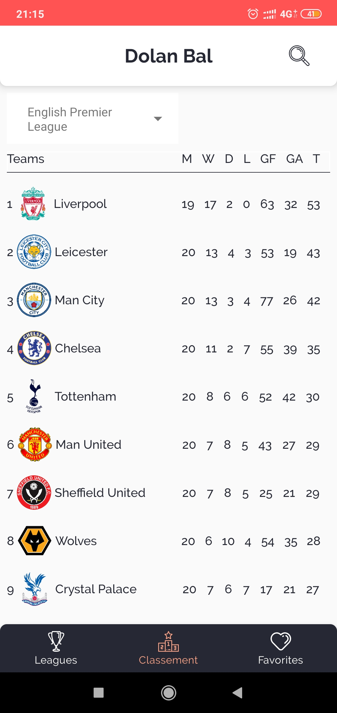
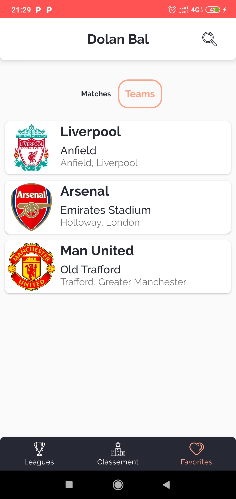
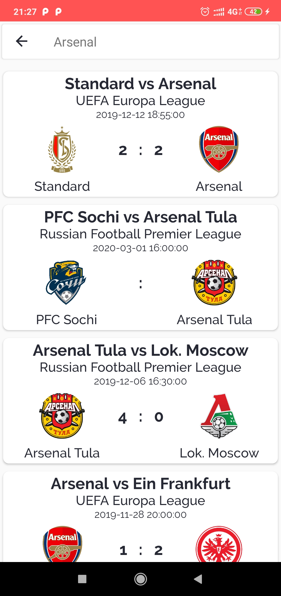
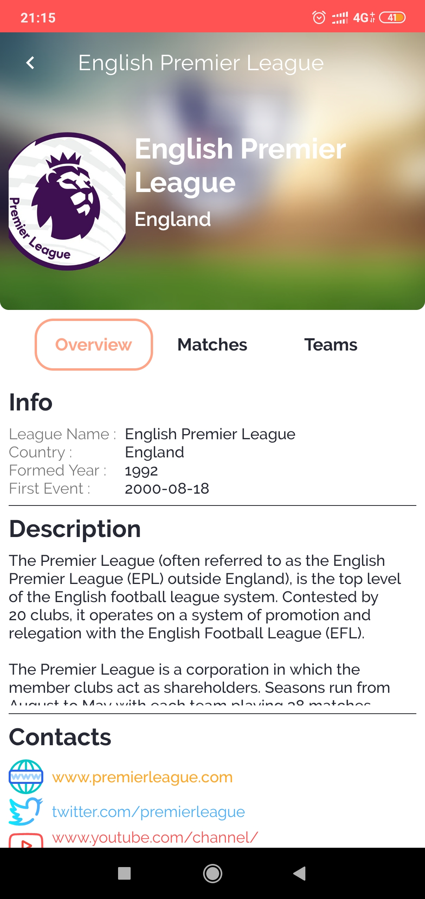
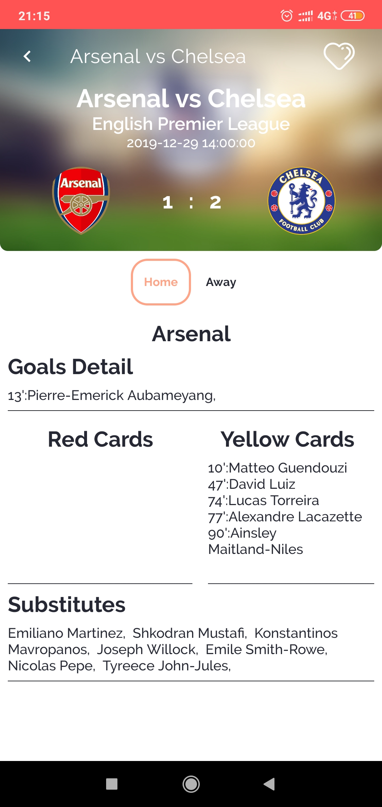
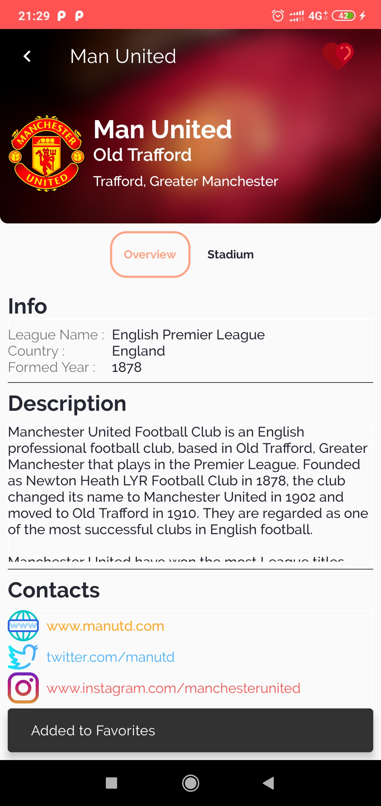

# FootballApp-DolanBal
Dicoding Kotlin Android Developer Expert Final Submission

A simple Football App written in Kotlin and MVVM Pattern
- ViewModel & LiveData
- Coroutines
- Data Binding
- Navigation Component
- Room 
- Anko Commons

